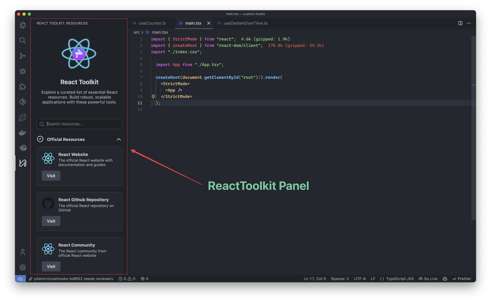
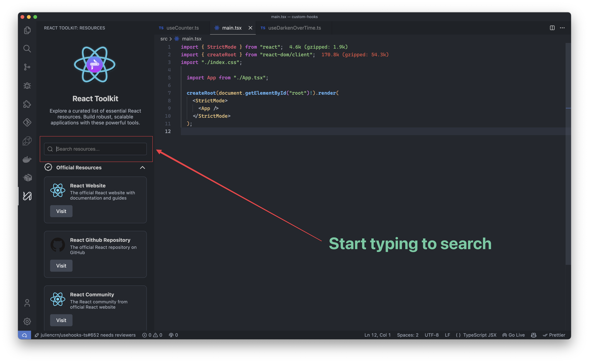

# React Toolkit for VS Code


> Boost your React development workflow with this comprehensive toolkit right in your VS Code editor!

## ✨ Features

React Toolkit brings a curated collection of essential React resources directly into your VS Code environment:

- 📚 **Resource Library**: Access a wide range of React resources, from official documentation to popular libraries and tools.
- 🔍 **Quick Search**: Easily find the resources you need with our built-in search functionality.
- 📂 **Categorized Content**: Resources are neatly organized into expandable categories for easy navigation.
- 🖼️ **Visual Identification**: Each resource comes with its logo for quick visual reference.
- 🌓 **Theme Compatibility**: Seamlessly integrates with VS Code's light and dark themes.

## 📸 Screenshots



_React Toolkit sidebar showing categorized resources_



_Searching for specific React resources_

## 🚀 Getting Started

1. Install the React Toolkit extension from the VS Code Marketplace.
2. Open the Command Palette (Ctrl+Shift+P or Cmd+Shift+P on macOS).
3. Type "React Toolkit" and select "Open React Toolkit" to launch the sidebar.
4. Browse through categories or use the search bar to find resources.
5. Click on a resource to visit its website or documentation.

## 📦 Available Resources

React Toolkit includes resources in various categories:

- Official Resources
- Component Libraries
- State Management
- Routing
- Forms
- Testing
- Styling
- Build Tools
- And more!

## 🔧 Configuration

React Toolkit works out of the box with no configuration needed. However, you can customize its behavior in your VS Code settings:

```json
{
  "reactToolkit.autoOpen": true, // Automatically open React Toolkit on startup
  "reactToolkit.defaultCategory": "Official Resources" // Set the default expanded category
}
```
